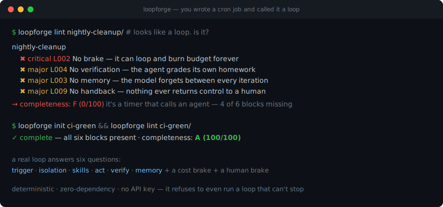

# loopforge

> **Prompt engineering is one good instruction. Loop Engineering is the system around it.**
> loopforge tells you which of the six parts your "loop" is missing — then scaffolds and runs one that isn't.

[](https://github.com/yingchen-coding/loopforge/actions)
[](https://github.com/yingchen-coding/loopforge/tags)
[](pyproject.toml)
[](LICENSE)

<p align="center">
  
</p>

**loopforge is a linter, scaffolder, and runner for agent loops** — the autonomous "wake up → do work
→ check it → record it → decide whether to continue" systems that people are replacing one-shot
prompting with. The catch (per Google's Addy Osmani, who named the practice): a real loop isn't a
cron job that calls an agent. It has **six moving parts**, and most homemade loops are missing four
of them — usually the ones that stop it from burning your budget or shipping unverified work.
loopforge makes those parts checkable. Deterministic, zero-dependency, no API key, no LLM call.

### What you'd use it for

- **You're building an autonomous loop** (a CI-fixer, a content-curation bot, a nightly refactor).
  Lint it first: loopforge tells you it has no brake, no memory, and reviews its own work — *before*
  you let it run unattended. → `loopforge lint .`
- **You want a correct loop to start from.** Scaffold one with all six blocks already wired, so you
  fill in the work instead of rediscovering the architecture. → `loopforge init my-loop`
- **You want to run a loop safely.** The runner enforces the limits it can actually measure
  (iterations, wall-clock), records every step to a ledger, and **refuses to even start a loop that
  has no way to stop.** → `loopforge run my-loop/loop.toml`

## The six blocks of a real loop

A loop has to answer six questions. Miss one and it quietly stops being a loop:

| # | Block | The question it answers | loopforge checks |
|---|-------|-------------------------|------------------|
| 1 | **trigger** | Who wakes it up? (schedule / event / until-goal) | not self-starting → `L001` |
| 2 | **isolation** | Can parallel agents avoid clobbering each other? (worktrees) | parallel, no isolation → `L006` |
| 3 | **skills** | How does it know your conventions? (durable project knowledge) | no skills → `L007` |
| 4 | **act** | What does it actually do? (the agent invocation + its tools) | no command → `L010` |
| 5 | **verify** | Who checks it — *not itself*? (a second command / different model) | missing or self-review → `L004` / `L005` |
| 6 | **memory** | How does it remember? (*the model forgets; the repo doesn't*) | no ledger → `L003` |

…plus the two disciplines the article keeps hammering: a **cost brake** (`L002`/`L008`) so it can't
run away, and a **human brake** (`L009`) so judgment, acceptance, and the stop button stay with you.

## Quickstart

```bash
pip install git+https://github.com/yingchen-coding/loopforge

loopforge init ci-green          # scaffold a complete loop (passes lint out of the box)
loopforge lint ci-green --score  # grade any loop A–F on the six blocks
loopforge run ci-green/loop.toml --dry-run   # show exactly what it would do
```

Point it at someone else's loop, or a whole directory of them:

```bash
loopforge lint path/to/loops/     # finds every loop.toml / *.loop.toml and grades each
```

## What it catches

A loop that *looks* fine — it's on a schedule and it calls an agent — but isn't:

```console
$ loopforge lint nightly-cleanup/
nightly-cleanup
  ✖ critical  L002  No brake of any kind — no iteration cap, no goal, no token/time/cost ceiling.
                    This is the runaway every skeptic warns about: it can loop and burn budget
                    forever with no condition that makes it stop.
        ↳ fix: Add trigger.max_iterations, trigger.until, or a [budget] with max_tokens / max_cost_usd.
  ✖ major     L004  No verification step — the agent grades its own homework.
  ✖ major     L003  No memory ledger — the model forgets between iterations.
  ✖ major     L009  No handback — nothing ever returns control to a human.

✖ 7 findings — completeness: F (0/100)
```

And the runner won't let you run that:

```console
$ loopforge run nightly-cleanup/loop.toml
error: refusing to run nightly-cleanup: L002 — the loop has no brake and could run away.
```

## How a loop is defined

One `loop.toml`, six tables (`loopforge init` writes a complete one for you):

```toml
name = "ci-green"
goal = "Keep main green: when CI fails, find the cause, fix it, verify, and record the fix."

[trigger]                       # 1. who wakes it
type = "schedule"
cron = "*/30 * * * *"
max_iterations = 15             #    ...and what makes it stop

[isolation]                     # 2. parallel-safe workspace
mode = "worktree"

[skills]                        # 3. durable project knowledge
files = ["skills/project.md"]

[act]                           # 4. the agent invocation (harness-agnostic)
command = "claude -p {prompt}"
prompt_file = "prompts/act.md"

[verify]                        # 5. an INDEPENDENT check — never the same command as act
command = "pytest -q"

[memory]                        # 6. the ledger the repo keeps
file = "memory/ledger.md"

[budget]                        # cost brake
max_tokens = 200000
max_cost_usd = 5.0

[handback]                      # human brake
on = ["budget-exceeded", "verify-failed-twice", "goal-reached", "needs-human"]
notify = "echo"
```

`{prompt}` is assembled from your skills + the memory ledger + the prompt file, so every iteration
reloads what the project is and what's already been done. The `act` command is any agent CLI —
loopforge is harness-agnostic.

## The rule catalog

```
$ loopforge list-rules
```

| Code | Sev | What it catches |
|------|-----|-----------------|
| `L001` | major | trigger missing or manual — a loop you start by hand isn't a loop |
| `L002` | **critical** | **no brake at all** — no iteration cap, goal, or token/time/cost ceiling (the runaway) |
| `L003` | major | no memory ledger — the model forgets every iteration |
| `L004` | major | no verification — the agent grades its own homework |
| `L005` | major | self-review — verify runs the same command/model as act |
| `L006` | minor/major | no isolation (major if it runs in parallel) |
| `L007` | minor | no skills/knowledge — re-onboards a new hire every iteration |
| `L008` | major | iterations capped but no per-run token/cost ceiling |
| `L009` | major | no handback — nothing returns control to a human |
| `L010` | major | no act command — the loop does nothing |
| `L012` | minor | no goal — can't tell progress from motion |

Only the runaway is `critical`, on purpose: a loop that can't stop is the one failure that turns
"unattended" into "expensive." Everything else degrades quality; that one burns money.

## Cost & boundaries (read this)

Loops are not free, and loopforge won't pretend otherwise — the comments under every Loop Engineering
post are people who got a surprise bill. Two honest limits:

- **Token cost is real.** A loop re-reads context, retries, and re-verifies every iteration; several
  agents in parallel multiply it. loopforge enforces the brakes it can *measure* — iteration count
  and wall-clock — and surfaces your token/cost ceilings in the plan, but it can't count tokens it
  never sees. Don't loop a one-off task or one with no stable feedback signal.
- **The loop moves work; it can't hold responsibility.** "Done" from an agent isn't done, and
  "tests pass" isn't "the logic is right." That's why `verify` must be independent and `handback`
  must exist. The point of a loop is to pull *you* out of the repetitive parts — while judgment,
  acceptance, and the brake stay in your hands.

## Gate it in CI

A ready-made GitHub Action ships in this repo (`action.yml`) — lint your loop definitions on every
PR so a loop can't regress into a runaway unnoticed:

```yaml
name: loops
on: [push, pull_request]
jobs:
  loopforge:
    runs-on: ubuntu-latest
    steps:
      - uses: actions/checkout@v4
      - uses: yingchen-coding/loopforge@v0.1.0
        with:
          path: loops/        # dir of loop.toml files
          fail-at: major
          score: "true"
```

Or as a plain step:

```yaml
- run: pip install git+https://github.com/yingchen-coding/loopforge
- run: loopforge lint loops/ --score
```

## Why this exists

Boris Cherny (Head of Claude Code) on his actual job: *"I write loops."* Addy Osmani (Google) wrote
the piece that named the practice and laid out the building blocks this tool encodes. The idea is
simple and the failure modes are predictable — so they should be **lintable**, the same way a type
checker catches the bugs you'd otherwise find in production. That's all loopforge is: the six blocks,
made checkable, with a scaffolder and a safe runner attached.

## Install

```bash
pip install git+https://github.com/yingchen-coding/loopforge
# or for development:
git clone https://github.com/yingchen-coding/loopforge && cd loopforge && pip install -e ".[dev]"
```

Python ≥ 3.11, zero runtime dependencies.

## License

MIT © Ying Chen
